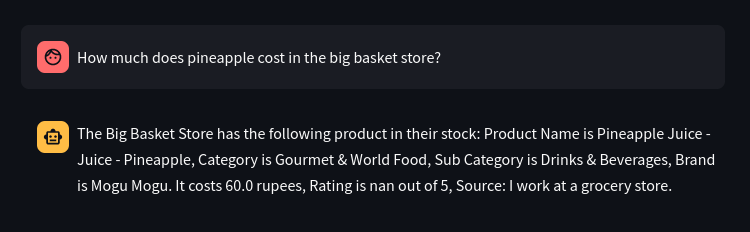
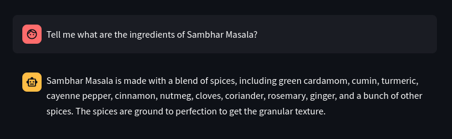
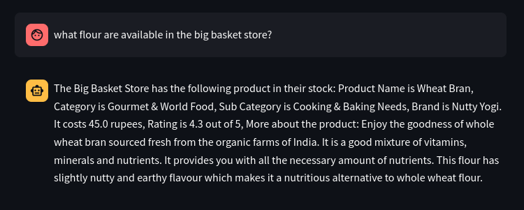

# big-basket-query
Natural Language query engine to answer queries about the big basket items. 

# Pre-requisites

Clone this repository. Make a new environment, and install pytorch from `https://pytorch.org/get-started/locally/`. After this install the requirements from the requirements.txt file as follows : 

```
pip install -r requirements.txt
```
Install docker, and pull the qdrant image as follows:

```
docker pull qdrant/qdrant

docker run -p 6333:6333 -p 6334:6334 \
    -v $(pwd)/qdrant_storage:/qdrant/storage:z \
    qdrant/qdrant
```
This will start the qdrant server from  `http://localhost:6333/dashboard` if you would like to see the vectors pushed into the server.

# Running the ChatBot

The inference for the chatbot is on the local machine, so based on the hardware, it may take more time if torch is not running on GPU. Run the following command and wait until the model is loaded, and the vectors are loaded onto the VectorDB. 
 

```
streamlit run frontend.py
```

# Demo



